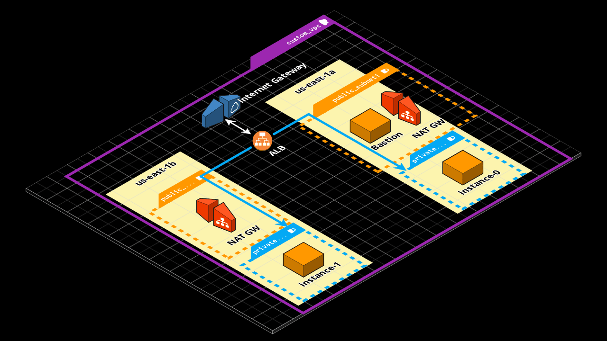

##### Provisionado 2xec2 em subnets privadas utilizando o provisioner "local-exec" utilizando SSH ProxyCommand por meio do Bastion Host acessar as instancias privadas para instalar um servidor web em 2 AZs com Application Load Balancer

##### Local state files

##### Estrutura provisionada

##### Requirements

* Terraform instalado, nesse caso utilizado v1.2.6
* Credenciais de acesso já criadas no IAM com as permissões necessárias para ec2
* aws_access_key_id e aws_secret_access_key geradas.

##### Instalando aws cli
`python3 -m pip install awscli`

##### Configurando Access Key ID and Secret Access Key na Região us-east-1
`aws configure`
`aws_access_key_id =`
`aws_secret_access_key =`

##### Arquivos terraform (Terraform irá processar todos os arquivos .tf)

##### Inicializando o diretório, baixando e instalando o provider da aws
`terraform init`
*Terraform has been successfully initialized!*

##### Acertar identação do terraform
`terraform fmt`

##### Validando configuração
`terraform validate`

##### Plano de configuração
`terraform plan`

##### Aplicando plano
`terraform apply`

