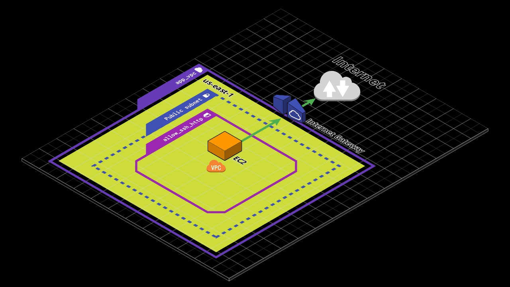
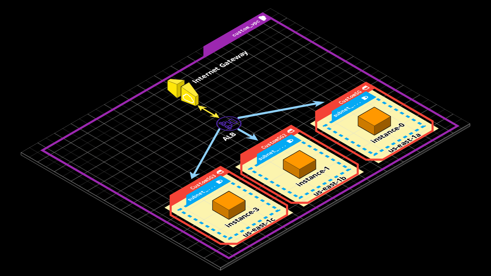
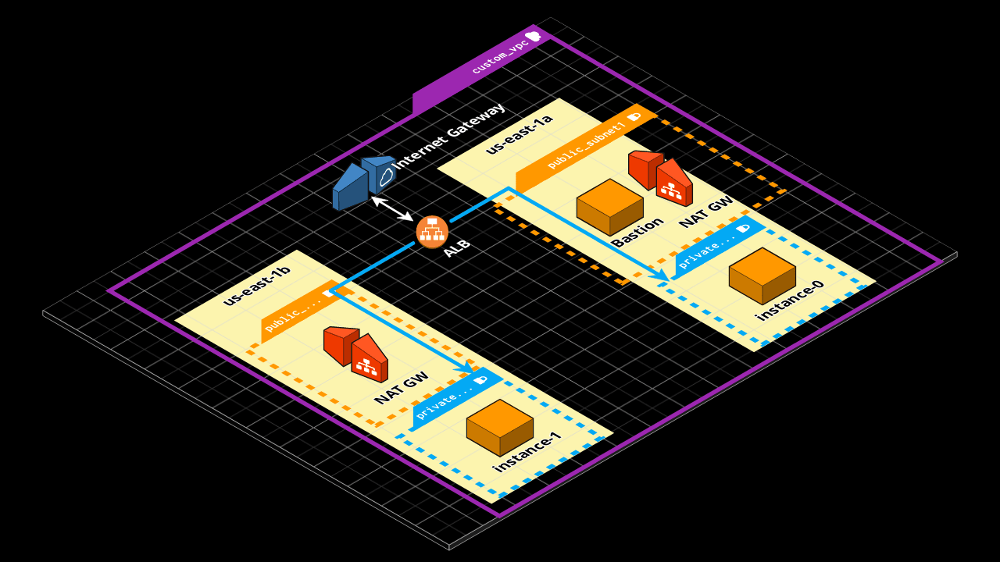

### Usando terraform AWS

### Contents 
  - [01-deploy-ec2](01-deploy-ec2/README.md)
  - [02-remote-state-s3-dynamo](02-remote-state-s3-dynamodb/README.md)
  - [03-ec2-webserver-remote-state](03-ec2-webserver-remote-state/README.md)
  - [04-3xec2-public-alb-maz](04-3xec2-public-alb-maz/README.md)
  - [05-1xbastion-2xprivate-ec2-alb-maz-userdata](05-1xbastion-2xprivate-ec2-alb-maz-userdata/README.md)
  - [06-1xbastion-2xprivate-ec2-alb-maz-local-exec](06-1xbastion-2xprivate-ec2-alb-maz-local-exec/README.md)

 

<table>
  <tr>
     <td style="text-align: center; vertical-align: middle;"><a href="03-ec2-webserver-remote-state/">03-ec2-webserver-remote-state</a></td>
    <td style="text-align: center; vertical-align: middle;"><a href="04-3xec2-public-alb-maz/">04-3xec2-public-alb-maz</a></td>
  </tr>
  <tr>
    <td style="text-align: center; vertical-align: middle;"></td>
    <td style="text-align: center; vertical-align: middle;"></td>
  </tr>
    <tr>
    <td style="text-align: center; vertical-align: middle;"><a href="05-1xbastion-2xprivate-ec2-alb-maz-userdata/">05-1xbastion-2xprivate-ec2-alb-maz-userdata</a></td>
    <td style="text-align: center; vertical-align: middle;"><a href="06-1xbastion-2xprivate-ec2-alb-maz-local-exec/">06-1xbastion-2xprivate-ec2-alb-maz-local-exec</a></td>
  </tr>
  <tr>
    <td style="text-align: center; vertical-align: middle;"></td>
    <td style="text-align: center; vertical-align: middle;"></td>
  </tr>
 </table>

 

